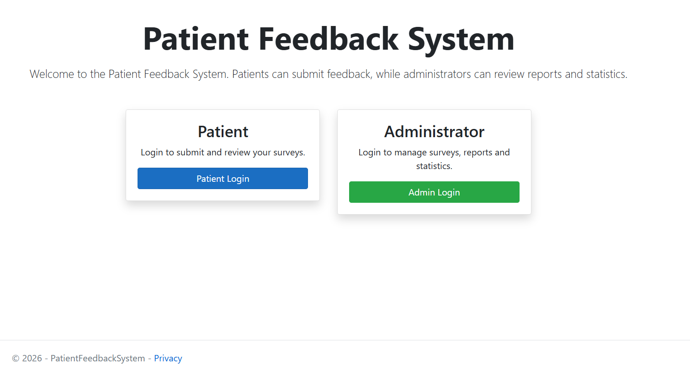
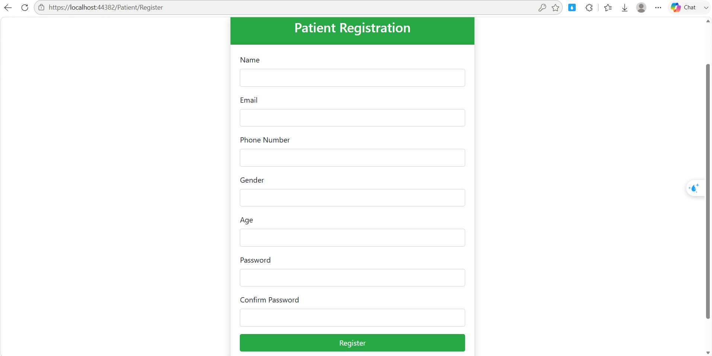
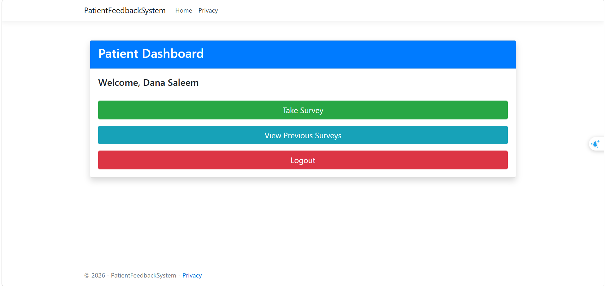
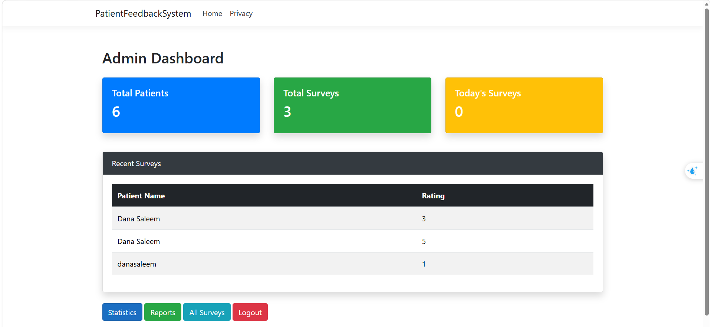
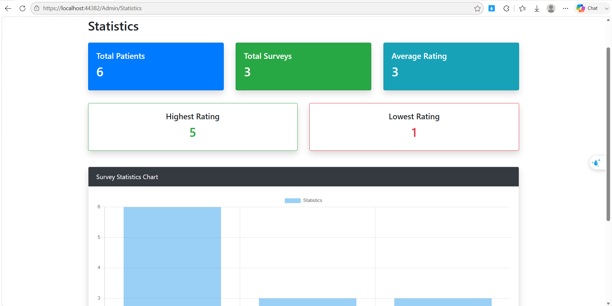

<p align="center">
  
</p>

# 🏥 Patient Feedback System


## 📌 Overview

Patient Feedback System is a web application developed using ASP.NET Core MVC that allows patients to submit feedback about healthcare services while providing administrators with tools to review, analyze, and manage patient responses.

The system helps healthcare organizations improve service quality by collecting patient opinions in a structured and organized way.

---

## ✨ Features

### 👤 Patient

- ✅ Register a new account
- ✅ Secure login and logout
- ✅ Submit patient feedback surveys
- ✅ View previous submitted surveys

### 👨‍💼 Administrator

- ✅ Secure administrator login
- ✅ Dashboard with real-time statistics
- ✅ View all patient surveys
- ✅ Search surveys by patient name
- ✅ Filter surveys by submission date
- ✅ View patient details
- ✅ View survey details
- ✅ Delete surveys
- ✅ Reports page
- ✅ Interactive statistics dashboard

---

## 📂 Project Structure

```
Controllers/
Models/
Views/
Data/
wwwroot/
```

---

## 🚀 How to Run

1. Clone the repository

```bash
git clone https://github.com/Dana-Almutairi/Patient-Feedback-System.git
```

2. Open the solution using Visual Studio.

3. Restore NuGet packages.

4. Update the SQL Server connection string if needed.

5. Apply database migrations.

6. Run the project.

---

## 👩‍💻 Author

Dana Almutairi

Software Engineering Graduate

---

## 📊 Screenshots

### 🏠 Home Page


---

### 📝 Patient Registration


---

### 👤 Patient Dashboard



---

### 🛠 Admin Dashboard


---

### 📈 Statistics


---

## 📄 License

This project was developed for educational and portfolio purposes.
